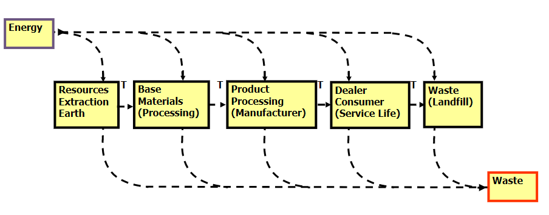
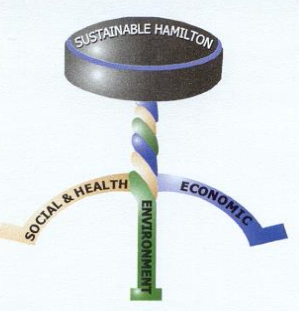

# 2B03 Engineering Economics

## Table of Contents
- [Grading](#grading)
- [Decision Pyramid](#decision-pyramid)
- [Dealing with Abstractions](#dealing-with-abstractions)
- [Modelling Process](#modelling-process)
- [Design Criteria](#design-criteria)
- [What is Sustainability](#what-is-sustainability)
- [Case Study Interface Carpets](#case-study-interface-carpets)
- [Time Value](#time-value)
- [Interest](#interest)
- [Simple Interest vs Compund Interest](#simple-interest-vs-compund-interest)
- [Cash Flow DIagrams](#cash-flow-diagrams)
- [Nominal Interest Rate](#nominal-interest-rate)
 
Professor email: church@mcmaster.ca

### Grading
- Midterm 30% (March 6 @ 7-9pm)
- Quizzes 20% 
	- (on [Avenue](http://avenue.mcmaster.ca/)) 
	- open Thursday, due Sunday - **1 attempt only**
- Exam 50%

_Final and midterm - 2 sided cribsheet & open textbook (can't print pdf)_
_will do problems in class_

\*_Sunday March 4th - 2hr tutorial before midterm_*

### Decision Pyramid


### Dealing with Abstractions
- engineering econ models typically represent a project through estimates
of costs and benefits of project over time

### Modelling Process


### Design Criteria
- function, cost, safety, sustainability

## Day 2 Jan 8, 2018

### What is Sustainability

- Linear Model
	- yields a lot of waste

	

- Closed Loop Model
	- Nothing should be wasted

	

#### Global Goals
- Waste nothing
- adapt to the place
- use free resources
- optimize not maximize
- create livable environemtnt

#### Metrics and Tools
- life cycle cost analysis
- life cycle assessment
- ecological footprint analysis

#### Stakeholders
- should take end-user into consideration
- eg juice box design - one time use, flimsy straws

#### Ethics
- engineers have responsibility towards
	- client
	- profession
	- society

#### Complexity

#### Triple Bottom Line
- need to think about social sustainbaility
	- socially sound, acessible to users
- environmental sustainability
	- conserve earth's resources and raw material
- economic sustainability
	- used to be the main focus

**Three Legged Stool**



### Case Study Interface Carpets
- cut down ecologcal footprint by 1/3
- claims to be world's first sustainable corporation
- over 5 billion pounds of carpet now in landfills
- went from selling carpets to leasing carpets (floor covering services)
- Benefits
	- carpet tiles used so only worn out parts replaced
	- increases net employment
	- eliminates disruption
	- less glue fumes
	- incentive of keeping it in good condition '**_drive it like a rental_**
- invented new type of floor-covering called Solenium that can be remanufactured
- all worn materials can be completely separated
- in 10 years they saved $262 mill
- won $20M contract from U of California
- went from trucking to rail
- cut shipping cost by 50%
- inspired Wal-Mart to deploy sustainable practices
- 72% reduction in waste water

## Engineering Economics

### Time Value
- would rather get a million dollars today vs 10 years
	- due to inflation
	- money has earning power over time (investments)
	- time allows money to earn interest

### Interest
- **_compensaion for giving up the use of money_**
- **_difference between amount of money lent vs paid_**


	```future worth = present worth + interest```

	```F = P + I```
	- I = Lump sum interest
	- i = interest rate

#### Lump-Sum Interest Rate
- 

**There is a legal interest rate, you can't go over 60%**
- or you get charged with usury

#### Nominal Interest Rate
- Interest rate - rate of interest charged for use of money, usually expressed as annual rate
- interest period - base unit over time whihc an interst rate is quoted, usually 1 year
- interest rate specified for one year is a **_nominal interest rate_**
- same as annual percent rate (APR)

#### Simple Interest
- rate that doesn't change
- rarely used in practice
- I<sub>S</sub> = PiN
- ``` F = P + PiN```

#### Compound Interest
- results in a lot more money

## Day 3 Jan 9, 2018

- Amortization Period
	- the duration over which a loan is calculated to be re-paid

### Simple Interest vs Compund Interest
- Simple Interest - method of computing interest where interest earned during interest period is **NOT** added to principal amount used to calculate interest in next period
- Compound - standard method of computing interest where interest accumulated in one interest period is added to principal amount used to calculate for next period
	- F = P(1 + i)<sup>N</sup> OR
	- P = F/(1 + i)<sup>N</sup>
	- I<sub>C</sub> = P(1 + i)<sup>N</sup> - P
	- F is future worth
	- P is principal 
	- i is interest rate/compunding period
	- N is number of compounding periods

#### Interest Rate Terms
- compounding period:time between points when interest is computed and added to initial amount
- Annual Percentage Rate (APR) - this is what you see in commercials
	- nominal interest rate on yearly basis
	- Cdn Tire is 25% per year

#### Sample Question
- if 5000 invested in savings account at nominal 4% compunded yearly, what is future worth in 3 years.
```
Question 1

P = $5000
i = 4%
N=3

F = P(1+i)^N 
  = (5000)(1 + 0.04)^3
```

```
Question 2

1626 to 2018
i = 6%
P = 24$
F = P(1 + i)^N
     = 1.88 B
```

#### Credit Card tool

### Cash Flow DIagrams
- represented by arrows and relevent periods
- upward arrow = positive flow
- down arrow = negative flow
- time 0 is considered **now**
- 

- can construct table outlining all cashflow activites
	- won't get marks for it but it helps 

### Nominal Interest Rate
- conventional method of stating annual interest rate
- 18% compounded daily --> ```i = 18%/365```
- ``` i = r/# compounding periods per year ```
- N --> if nothing is stated, assume yearly **except** in car payments and mortgages - assume monthly


