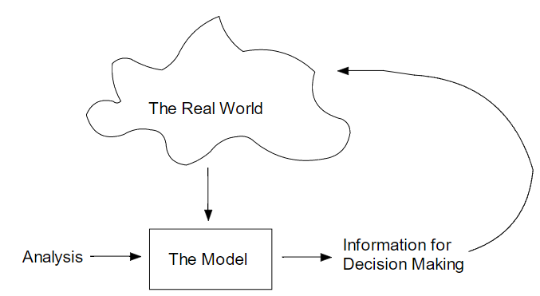
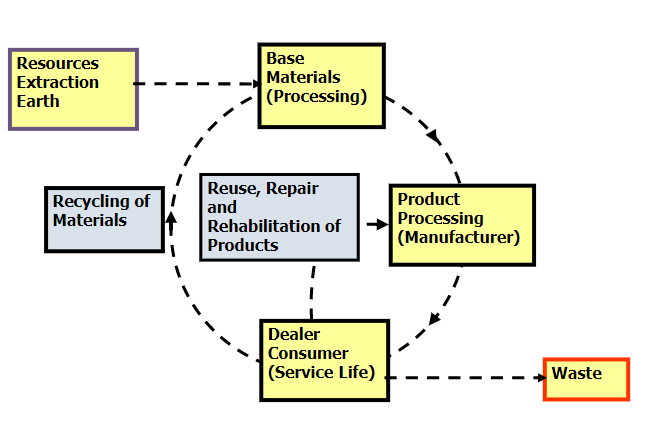
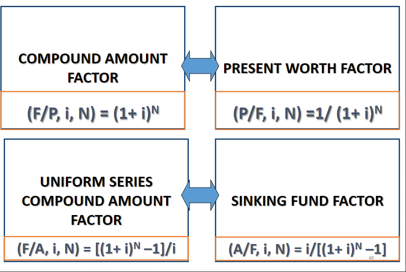
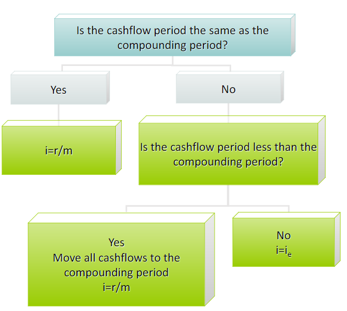
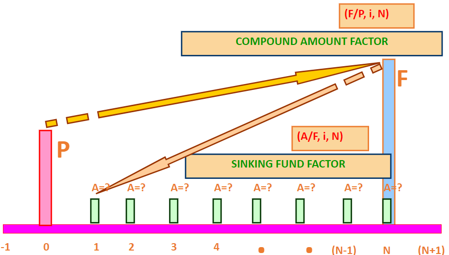

# 2B03 Engineering Economics

## Table of Contents
- [Course Outline](#course-outline)
- [Making Decisions](#making-decisions)
- [What is Sustainability](#what-is-sustainability)
- [Business Models](#business-models)
- [Important Variables in Sustainable Development](#important-variables-in-sustainable-development)
- [Case Study Interface Carpets](#case-study-interface-carpets)
- [Intro, Time Value of Money](#intro-time-value-of-money)
- [Interest](#interest)
- [Lump-Sum Interest Rate](#lump-sum-interest-rate)
- [Nominal Interest Rate](#nominal-interest-rate)
- [Simple Interest](#simple-interest)
- [Compound Interest](#compound-interest)
- [Interest Rate Terms](#interest-rate-terms)
- [Cash Flow Diagrams](#cash-flow-diagrams)
- [Nominal Interest Rate Revisited](#nominal-interest-rate-revisited)
- [Timing of Cash Flow and Modelling](#timing-of-cash-flow-and-modelling)
- [Comtinuous Compounding](#comtinuous-compounding)
- [Equivalence](#equivalence)
- [Simplification of Cash Flow](#simplification-of-cash-flow)
- [Compound Amount Factor](#compound-amount-factor)
- [Present Worth Factor](#present-worth-factor)
- [Textbook](#textbook)
- [Sinking Fund Factor and Annuity](#sinking-fund-factor-and-annuity)
- [Uniform Series Compound Amount Factor](#uniform-series-compound-amount-factor)
- [Effective Interest Rate](#effective-interest-rate)
- [Nominal vs Effective Interest](#nominal-vs-effective-interest)
- [Efective Interest Examples](#efective-interest-examples)
- [Effective Interest Rate and Cash Flow Period](#effective-interest-rate-and-cash-flow-period)
- [Critical Point](#critical-point)
- [What Interest Rate to Use](#what-interest-rate-to-use)
- [Capital Recovery Factor](#capital-recovery-factor)
- [Salvage Value](#salvage-value)
- [Series Present Worth Factor](#series-present-worth-factor)
 
## Day 1 Jan 4, 2018

### Course Outline

Professor email: church@mcmaster.ca

**Grading**
- Midterm 30% (March 6 @ 7-9pm)
- Quizzes 20% 
	- (on [Avenue](http://avenue.mcmaster.ca/)) 
	- open Thursday, due Sunday - **1 attempt only**
- Exam 50%

_Final and midterm - 2 sided cribsheet & open textbook (can't print pdf)_
_will do problems in class_

\*_Sunday March 4th - 2hr tutorial before midterm_*

### Making Decisions

**Decision Pyramid**


**Dealing with Abstractions**
- engineering econ models typically represent a project through estimates
of costs and benefits of project over time

**Modelling Process**



**Uncertainty and Sensativity Analysis**
- engineers make predictions using economic models
- sensativity analysis can identify _robust_ decisions
- we use design criteria

**Modern Design Criteria**
- components are function, cost, safety, sustainability

## Day 2 Jan 8, 2018

### What is Sustainability

> "Development that mettes needs of the present generation without compromising the ability of future generations to meet their own needs.
> SD is not a fixed state of harmony but a process of change in which exploitation of resources, direction of investment, orientation of technological development and institutiona change are made consistent"
\- UNICED 1987

### Business Models
- Linear Model
	- yields a lot of waste

	

- Closed Loop Model
	- Nothing should be wasted

	

### Important Variables in Sustainable Development

#### Global Goals
- Waste nothing
- adapt to the place
- use free resources
- optimize not maximize
- create livable environemtnt

#### Metrics and Tools
- life cycle cost analysis
- life cycle assessment
- ecological footprint analysis

#### Stakeholders
- should take end-user into consideration
- eg juice box design - one time use, flimsy straws

#### Ethics
- engineers have responsibility towards
	- client
	- profession
	- society

#### Complexity
- important for engineers to understand that their activites and designs will be operating in very complex systems

#### Triple Bottom Line
- need to think about social sustainbaility
	- socially sound, acessible to users
- environmental sustainability
	- conserve earth's resources and raw material
- economic sustainability
	- used to be the main focus

**Three Legged Stool**


### Case Study Interface Carpets
- example of company that has been trying to be more sustainable
- cut down ecologcal footprint by 1/3
- claims to be world's first sustainable corporation
- over 5 billion pounds of carpet now in landfills
- went from selling carpets to leasing carpets (floor covering services)
- Benefits
	- carpet tiles used so only worn out parts replaced
	- increases net employment
	- eliminates disruption
	- less glue fumes
	- incentive of keeping it in good condition '**_drive it like a rental_**
- invented new type of floor-covering called Solenium that can be remanufactured
- all worn materials can be completely separated
- in 10 years they saved $262 mill
- won $20M contract from U of California
- went from trucking to rail
- cut shipping cost by 50%
- inspired Wal-Mart to deploy sustainable practices
- 72% reduction in waste water

### Intro, Time Value of Money
- would rather get a million dollars today vs 10 years
	- due to inflation
	- money has earning power over time (investments)
	- time allows money to earn interest
- engineering decisions involve analysis of costs and benefits
- key to this financial analysis and comparison is the **"interest"** 

### Interest
- it is the **_compensation for giving up the use of money_**
- it is the **_difference between amount of money lent vs paid_**
- the _difference_ between a present amount of money an future amount is **interest**
	- ```future worth = present worth + interest```
	- ```F = P + I```
	- I = Lump sum interest
	- i = interest rate
	- F = future worth
	- P = present worth

### Lump-Sum Interest Rate
- when interest is specified as a percentage of the money borrowed (common)
- then...

```
I = Pi
F = P + I
  = P + Pi
  = P(1 + i)
```
#### Example
Peter wishes to borrow $50000 from his uncle and promises to pay it back after 3 years. His uncle agrees provided Peter pays 60% interest

**There is a legal interest rate, you can't go over 60%**
- or you get charged with usury
- also, lump sum is rarely used

```
i = 60%
I = P*i = 50000*(0.6) = 30000
Therefore F = P + I = 80000
```

### Nominal Interest Rate
- **Interest rate** may be specified for an **interest period**

> Interest rate - rate of interest charged for use of money, usually expressed as annual rate

> interest period - base unit over time which an interest rate is quoted, usually 1 year
- interest rate specified for one year is a **_nominal interest rate_**
- same as annual percent rate (APR)

### Simple Interest
- rate that doesn't change
- rarely used in practice
- I<sub>S</sub> = PiN
- ``` F = P + PiN```
- there is also compound interest which results in a lot more money

#### Example 1
If $5000 is invested in a savings account at an interest rate of 4% per year, calculate simple interest earned over 3 years.

```
P = 5000
i = 4%
N = 3
I = P*i*N
  = 5000*0.04*3
  = 600
```

#### Example 2
If $5000 is invested in a savings accuont at interest rate of 4% per year, calculate the future worth of investment at the end of 3 years.

```
F = P + I
  = P + P*i*N
P = 5000
I = calculated as 600 in previous example
Therefore, F = 5600
```

## Day 3 Jan 9, 2018

- Amortization Period
	- the duration over which a loan is calculated to be re-paid

### Compound Interest
- **Simple Interest** - method of computing interest where interest earned during interest period is **NOT** added to principal amount used to calculate interest in next period
- **Compound** - standard method of computing interest where interest accumulated in one interest period is added to principal amount used to calculate for next period
	- F = P(1 + i)<sup>N</sup> OR
	- P = F/(1 + i)<sup>N</sup>
	- I<sub>C</sub> = P(1 + i)<sup>N</sup> - P
	- F is future worth
	- P is principal 
	- i is interest rate/compunding period
	- N is number of compounding periods

### Interest Rate Terms
- compounding period:time between points when interest is computed and added to initial amount
- Payment Period/Cashflow Period - shortest time between payments
- Nominal Rate (r) - simplified expression of annual cost of money
- Annual Percentage Rate (APR) - this is what you see in commercials
	- nominal interest rate on yearly basis
	- Cdn Tire is 25% per year
- Effective Rate - is the rate that is used with the table factors or the closed form equations.
	- it converts nominal rate taking into account both the compounding period and the payment period

#### Sample Question 1
If $5000 is invested in savings account at nominal interest rate of 4% compunded yearly, what is future worth in 3 years?

```
P = $5000
i = 4%
N=3

F = P(1+i)^N 
  = (5000)(1 + 0.04)^3
  = 5624.32
```

#### Question 2
If $5000 is invested in a savings account at nominal rate of 4% compounded yearly, calculate the compound interest over 3 years

```
P = 5000, i = 4%, N=3
Ic = P(1+i)^N - P
   = 5624.32 - 5000
   = 624.32
```
#### Question 3
Manhattan Island was purchased for $24 in 1626. If that was invested at 6% how much would it be today?

```
i = 6%
P = 24$
N = 2018 - 1626
F = P(1 + i)^N
     = 1.88 B
```
#### Question 4
I borrow $100 now and pay you $1000 4 years from now. What is the implied interest rate?

```
Compound
F = P(1+i)^N
1000 = 100*(1+i)^4
i = 0.778

Simple
F = P*i*N
1000 = 100*i*4
i = 2.5
```

#### Credit Card tool
- and excel

### Cash Flow Diagrams
- represented by arrows and relevent periods
- upward arrow = positive flow (receipts)
- down arrow = negative flow (disbursements)
- time 0 is considered **now**
- 

- can construct table outlining all cashflow activites
	- won't get marks for it but it helps 
- period from 0 to 1 is period 1, -1 to 0 is period -1
- end of period means the arrow will be drawn at that period

### Nominal Interest Rate Revisited
- conventional method of stating annual interest rate
- 18% compounded daily --> ```i = 18%/365```
- ``` i = r/# compounding periods per year ```
- N --> if nothing is stated, assume yearly **except** in car payments and mortgages - assume monthly

#### Example 1
How much is accumulated after 2 years when you deposit $900 into a savings plan that is 12% compounded monthly?

```
P = 900
N = 2*12 = 24
i = 12%/12 = 1%

F = P(1+i)^N
  = 900(1+0.01)^24
  = 1142.76
```

## Day 4 Jan 11, 2018

### Timing of Cash Flow and Modelling

- Discrete Model
	- models that assume all cash flows occur at ends of conventional periods
- Continuous Model
	- not that common
	- assumes that all cash flow occurs continuously - continuous compund period

- can have discrete _cashflow_ and discrete _compounding_
- discrete cash flow - continuous compoounding
- continuous cash flow - continous compounding
- can't have continuous - discrete (continuous money and monthly period)

### Comtinuous Compounding
- i<sub>c</sub> = effective compound interest rate/year
- r = nominal interest rate/year
- m = number of compounding periods in one year which is approaching infinity
- ```i = r/m``` and ```F=P(1+i)^n```


#### Example 1
What is the effective interest rate of an investment with a 6% nominal interest rate, compounded continuously?

```
using limit: e^0.06 - 1
```

### Equivalence
- condition that exists when value of cost is equivalent to another
1. Mathematical equivalence
	- million dollars today or million dollars in 10 years -- not equivalent in terms of value
	- million today or 1.5 mill in 10 years **may** be equivalent
2. Decisional equivalence
	- indifferent between P dollars now abd F dollars N periods from now
	- inferring implied interest rate from P, F and N
3. Market equivalence
	- decision makers can echange different cashflows in market at 0 cost
	- common when you're shopping around eg mortgages

- if market equivalence holds and decisional can be expressed in monetary terms, then we can assume that mathematical equivalnce can be used

### Simplification of Cash Flow
- for when it gets too complex
- Convention: Sample Factor (compound amount factor)
	- ```(F/P, i, N)``` = (1+i)<sup>N</sup>
	- read as F given P, i, N
	- F = P(1+i)<sup>N</sup> = P(F/P, i, N)
	- P = F/(i+1)<sup>N</sup> = F(P/F,i,N)

#### Assumptions of Compounding Interest Factors
- if we have N periods, they have to be equally spaced
- payment at time 0 can be considered at end of period -1: _today_
```
@ 2 is end of 2nd month, beginning of 3rd month
          |
  --------------
  0   1   2   3	
  ```

#### Example
- present worth P of cashflow with arrows at 3 and 5
- P = sum of those future amounts 
= P<sub>0</sub> = F1/(1+im)^3 + F2/(1+im)^5
- in short form = F1(P/F, im, 3) + F2(p/F, im, 5)


## Day 5 Jan 15, 2018

### Compound Amount Factor

```(F/P, i, N)```
- allows you to mve single arrow to the future

#### Example 1
If you loan a friend $5000 so that they can buy a portable generator and they promise to repay you with an interest rate of 4% per year, calculate value of your investment in 3 years.

```
P = 5000
N = 3
i = 4%
F = P(1+i)^N
  = 5000*(1+0.04)^3
  = 5624.32
```

#### Example 2
How much money will be in a bank account at the end of 2 years if $5000 is deposited today? Interest rate is 12% compounded monthly.

```
P = 5000
N = 2*12
i = 12%/12 = 1%
F = P(1+i)^N
  = 5000*(1+0.01)^24
  = 6348.67
```

#### Example 3
How much money will be in a bank account at the end of 4 years if $5000 is deposited at the end of each year? Interest rate is 12% compounded monthly.

- multiple arrows for this one
- move all arrows to the future (to 48 months)

```
       |    |    |    |
  ---------------------
  0   12   24   36   48

Use equation 4 times
P = 5000
N = 12 24, 36, 48
i = 12%/12 = 1%
F = 5000(F/P, 0.01, 36) + 5000(F/P, 0.01, 24) + 5000(F/P, 0.01, 12) + 5000

```

**First quiz will be up on avenue on thursday! Due Sunday**
	- everything up to the thursday lecture

### Present Worth Factor

```(P/F, i, N)``` = 1/(1+i)<sup>N</sup>

```P = F/(1+i)^N```

- gives present amount from F
- bringing arrow from future back _N compounding periods_

#### Example 4
What amount desposited today into account bearing 12% nominal interest will give $5000 at the end of 2 years? Interest compunded monthly
```
i = f/m = 12%/12 = 1%
P = F(i/(1+i)^N)
P = F(P/F, 1%, 24)
```

#### Example 5
How much would you deposit into savings account at nominal interest rate 6% **yearly** to accumulate $5000 in 3 years

```
calculating P
P = F(P/F, 6%, 3)
```

### Textbook
- find it online and put the formulas in your crib sheet
- Appendix A - discrete discrete
- Appendix B and C - continuous - continous, discrete - continuous 

#### Example 6
Using interest tables, 12% nominal interest with monthly compunding (1%), N = 24 months, how much do I deposit today therefore you know F not P
- look for 1% and N = 24 = 0.7875 (tbh it's easier to calculate :grimacing:)

## Day 6 Jan 16, 2018

### Sinking Fund Factor and Annuity

```(A/F, i, n)``` = i/[1+i)<sup>N</sup> - 1]

**Annuity**
- a series of equal cash flows that start at the end of the first period, continue over N reglarly spaced time intervals
	- paycheck (in), cellphone bill (out)
- gives size of annuity that is equivalent to a future amount F
- N is the number of annuities
- if N = 12, there should be 12 annuities on cash flow diagram

#### Example 1
Melissa is saving up for server in 3 years. She thinks she needs $5000 and intends to put aside a uniform amount at the end of each year (an annuity). If nominal interest rate is 6%, how much should she put aside each year?

- cashflow diagram would have 3 annuities, totalling on the third one
- **note**: last annuity has to be on same space as total

```
r = rate = 6%
i = f/m = 6%
A = F(A/F, i, N)
  = 5000(A/F, 6, 3)
```

- however, if her first deposit is today, N=4!! **Example 2**

### Uniform Series Compound Amount Factor

```(F/A, i, n)```

```F = A(1 + i)```<sup>```N-j```</sup>

- if you have a quetion like what is F at 20 given 10 annual payments of $1000 at an interest rate of 5%. 
- F20 = 1000(F/A, 5%, 10) **wont** tell you what you have after 20 years, it's only after 10 years
- To get 20 years, use F given P equation. multiply the above by (F/P, 5%, 10) or if after 15 years, (F/P, 5%, 5)
- **DON'T WRITE** F20 = 1000(F/A, 5%, 20) because it means you have 20 $1000 payments

#### For Single Transactions
- Compound Amount Factor (F/P, i, N)

#### Example 3
Bob wants new truck in 3 years. If he saves $25000 each year and puts it in savings w/ annual rate of 4% how much will he have in 3 years
- N = 3, F = ?
- 25000(1 + 0.04)<sup>3-1</sup> + 25000(1 + 0.04)<sup>3-2</sup> + 25000(1 + 0.04)<sup>3-3</sup>
 = 27040 + 26000 + 25000 = 78040



### Effective Interest Rate

 - actual annual interest rate obtained when the compunding period is less thaan 1 year is called the _effective interest rate/year_
 - denoted by i<sub>e</sub> (or subscript annual, quarterly, weekly)
 - if cashflow period is less than compounding period the cashflows will be _collapsed_ to the compounding period
 - no effective interest rates in first quiz
	- will be about first lecture, calculations on moving arrows on cashflow diagram, F given A, A given F application

## Day 7 Jan 18, 2018

### Nominal vs Effective Interest
- nominal - stated rate of interest
- effecive interest rate - rate actually paid or earned because of compounding period less than 1 year
	- i<sub>e</sub> = effective interest rate/year
	- r = nominal interest rate/year
	- m = # of compounding periods in 1 year
	- r/m = nominal i/compunding period

**Equating future worth after 1 year**

```F = P(1 + i```<sub>```e```</sub>```) = P(1 + r/m)```<sup>```m```</sup>

thus ```i```<sub>```e```</sub> ```= (1 + r/m)```<sup>```m```</sup> ``` - 1```

### Efective Interest Examples

#### Example 1 Slide 49
WHat is the effective interest rate/year of an investment with a 6% nominal interest rate, compounded daily?

```
r = 6%
m = 365
ie = (1 + r/m)^m - 1
   = 6.18%
```

**\*if i<sub>e</sub> only compounded once a year then it's equivalent to r*\**

**\*if compounded daily for ex. 6% it becomes 6.18%*\**

#### Example 2 Slide 53
How much money will be in a bank account at the end of 2 years if $5000 is deposited today? The interest rate is 12% compounded monthly.

- single arrow on cashflow diagram
```
(F/P, i N) = (1 + i)^N
F = 5000(1 + 12%/12)^24

is equivalent to

ie = (1 + 12%/12) - 1
F = 5000(1 + ie)^2 

F = 6348.67
```

### Effective Interest Rate and Cash Flow Period
- calculation period other than a year
	- nominal interest rate (r) is the conventional annual interest rate
	- compounding period (m) is the period used with compound interest method of computing interest
	- cash flow period (k) is the base unit of time over which an i<sub>e</sub> rate is calculated (may not be 1 yr)
		- k is the # compounding periods in 1 cashflow period

Therefore i<sub>e/k</sub> = (1+r/m)<sup>k</sup> - 1

#### Example 3
An investment earns a 6% nominal interest rate, compounded daily. What is the effective interest rate for a cashflow period of 1 month (30 days)?

```
ie = (1+r/m)^k - 1
   = (1+0.06/365)^30 - 1
   = 0.0049
   = 0.49%
```

**continued**

```
F in 5 years
F = A(F/A, 6%/365, 60)
```

### Critical Point
- when using factors, **n** and **i** must always match
- ex if using (1+i)<sup>N</sup>, the N and i should both be calculated w.r.t same unit of time
- **NOTE** 
	- interest doesn't start accumulating until the money has been invested for the full period
	- if cashflow period is less than compounding period then add up cashflows in compounding period to a single arrow
	- 

#### Example 4
A $5000 investment earns a 6% nominal interest rate compounded daily. What is the future worth of the investment after 5 years, using a cash flow period of 1 month?

**30 days is a bankers month**

```
ie = (1 + r/m)^k - 1
   = (1 + 0.06/365)^30 - 1

F = 5000*(1 + ie)^60
  = 6721.46
```

#### Example 5
A $5000 investment earns a 6% nominal interest rate, compounded daily. What is the future worth of the investment after 5 years using a cash flow period of 6 months?

```
ie<month> = (1 = r/m)^k - 1
Therefore k = 182 and N = 2*5 = 10
```

#### Example 6
Suppose you make quarterly deposits in a savings account which earns 9% interest compounded monthly. Compute the effective interest rate per quarter.
- per quarter = 4 times a year

```
ie = (1+r/m)^k - 1
m = 12
k = # compounding periods in each cashflow period = 3

ie<3 months> = 2.27%
```

### What Interest Rate to Use



## Day 8 Jan 22, 2018
- next quiz will cover Day 9 (effective interest rate)

#### Example 1
A dot-com company plans to place money in a new venture capital fund that currently returns 18% per year, compounded daily. WHat effecctive rate is the a) yearly, b) semi-annually, c) quarterly, d) monthly?

```
ie = (1+r/m)^k - 1
m = 365 -> linked to effective interest rate and won't change
k = # compounding periods in cashflow period

a) k = 365 days
ie = 19.716%

b) k = 182 days
ie = 9.388%

c) k = 91 days
ie = 4.589%

d) k = 30 days
ie = 1.49%
```

#### Example 2 (effective)
Suppose you make equal quarterly deposits of $1000 into a fund that pays interest at a rate of 12% compounded monthly. Find the balance at the end of year 2.
- need to figure out k because cashflow period is more than compounding period

```
m = 12
i = r/m = 12%/12 = 1%
k = quarterly = 3
ie = (1+r/m)^k  - 1
ie = 3.03%

F = A(F/A, i, N)
  = 1000*(F/A, 3.03, 8) <--2 years of quarters
  = $8901.81
```

#### Example 3 (r/m)
Suppose you make equal quarterly deposits of $1000 into a fund that pays interest at a rate of 12% compounded quarterly. Find the balance at the end of year 2.

- same cashflow as example 2, different compounding periods. Use flow chart
- if cashflow period less than compounding period, use i = r/m
- in this case, cashflow period (quarterly) is same as compounding period

```
m = 4
i = 12%/4 = 3%
```

#### Example 4
You have a trust fund that will become available to you 3 years from now (at the end of third year). The fund will pay $10000 every 6 months starting at the end of the 3rd year for 10 years (to the end of 13th year). If you invest all this money into a savings acount that has an interest rate of 8% compounded weekly how much money will yu have 30 years from now?

- cashflow and compounding period are different (cashflow is 26 weeks, compounding is weekly, 52)

```
                  |  |  |  |  |      |
--------------------------------------
0  1  2  3  4  5  6        25  26    60

    (semi-annual)

r = 8%
m = 52
k = 26

ie = (1+r/m)^k - 1
   = (1+0.08/52)^26
   = 0.041

N = the number of arrows on cashflow diagram
  = by the end of 4th year there will be 3 arrows
  = by the end of 5th year there will be 5
  = (year_n - 3)*2 + 1 
  = 21

F_26(13th year) = 10000*(F/A, ie, 21)
F = A*i/[(1+i)^N - 1]
  = 10000*0.041/[(1+0.04)^21 - 1]
  = 322441.07

Now find future worth
F = P*(F/P, ie_month, 34)
  = 1254989.39
(F/P, ie_weekly(r/m), 884)
```

#### Example 5
You recently received $50000 from a relative. Your advisor told you he found a 1-year investment for you that provides 15% interest compounded monthly. 

1. What is the effective annual interest rate based on nominal rate of 15% compounded monthly?

```
~special case k = m~

ie = (1+r/m)^m - 1
   = (1+0.15/12)^12 - 1
   = 0.160755
```

If you invest $50000 today how much will you have at the end of 1 year?
```
i = 16.08%
N = 1

F = 50000*(F/P, i, N)
  = 50000*(1+0.1608)^1
  = 58037.75

OR

i = r/m = 16.08%/12
N = 12
```

## Day 9 Jan 23, 2018

Discussion on investing in ACB :trollface:

#### When to use effective interest 
Whenever you have annuity equation, you'll probably have to use effective interest because you have multiple arrows. If single arrow, can use either r/m or effective, it doesn't matter. Best to use the decision flowchart.

**Do problems on Avenue**

#### From last

Hector says he will make the investment for you at fee of 2% of investments total value 1  year from now. What is the effective annual interest rate of this investment after paying Hector's fee?

```
So you have 58037*0.02 going to Hector
That leaves 56876 at the end of one year.

F1 = 56876
P = 50000
N = 1
F = P(1+i)^N
56876 = 50000(1+i)^1 
i = 13.75%
```

If your relative, instead of a lump sum, offered you 4 quarterly installments of $12500 each, how much would you have at the end of one year using Hector's investment (disregard Hector's fee). 

```
F1 = 12500(F/P,i,N) + 12500(F/P,i,N) + 12500(F/P,i,N) + 12500
15% compounded monthly therefore i = r/m = 15%/12
N would be 9, 6, and 3.

From original wording -> compouding monthly, cashflow quarterly.
Since cashflow is not less than compounding period, use effective interest

k = number of compoundng periods in cashflow period = 3
i_quarterly = (1+r/m)^k - 1
            = (1+0.15/12)^3
            = 3.8%
F = 12500(F/A, 3.8%, 4)
F = 12500((1+i)^4-1)/i
F = 12500(4.233)
F = $52920

If it was semi-annual compounding and cashflow still quarterly, we would do i = r/m because cashflow is less than compounding.
i = r/m = 15%/2

F = 25000(i+r/m)^1
OR
F = 25000(F/A, r/m, 2)
both give same answer
```

On test you'll get questions like:
- If cashflow is daily and compounding is monthly, what is your interest rate?

### Capital Recovery Factor

(A/P, i, N) = (A/F, i, N)\*(F/P, i, N) = i*(1+i)<sup>N</sup>/[1+i]<sup>N</sup>-1]

- how much money do I have to save/make to make my investment worthwhile
- gives value, A, of the equal periodic payments or receipts that are equivalent to a present amount P, where
- cashflow diagram starts with initial amount P and you get annuities during the following N periods
- uses F given P equation and A given F equation



#### Example 1
You are considering buying a digital camera for $5000 which you will use for 5 years. It has 0 salvage value. If the nominal interest rate is 10%, what is the expected yearly return on the camera.
- how much money camera needs to bring in to breakeven

```
A = P(A/P, i, N)
A = 5000(A/P, 10, 5)
*compounding and cashflow periods are both annual*
A = 5000*(0.26380)
  = 1319
```

### Salvage Value
- most assets have a value for which they can be sold for
- **WONT** be on Quiz 2

		A = P(A/P, i, N) = S(A/F, i, N)

#### Example 2
You are considering replacing your water heater and buying compact point-of-use water heaters for $5000 with a salvage value of $500 after 5 years. If the nominal interest rate is 10%, what is the expected yearly return on the compact heaters.

```
A = P(A/P, i, N) - S(A/F, i, N)
  = 5000(A/P, 10, 5) - 500(A/F, 10, 5)
  = 1237.10

```

### Series Present Worth Factor

(P/A, i, N)

- when you have annuities and you want to find P
- reciprocal of the previous equation

#### Example 3
Repaying your tuition requires 24 montly payments of $565. Interest is charged at an annual rate of 12% compounded monthly. How much is your loan?

```
(P/A, i, N)
P = 565
i = 12%/12
N = 24 (# of annuities)
```

Midterm - Mar 6, 7-9

## Day 10
- no lecture on Thursday!
- 
