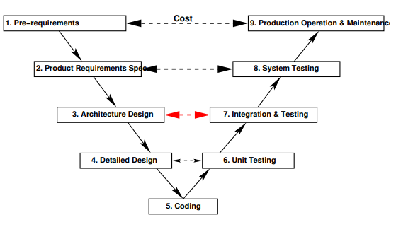
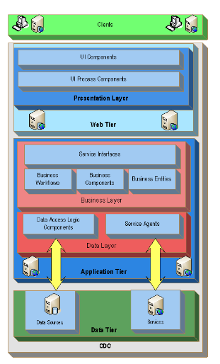
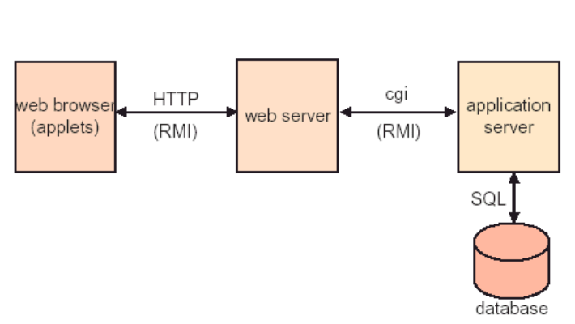
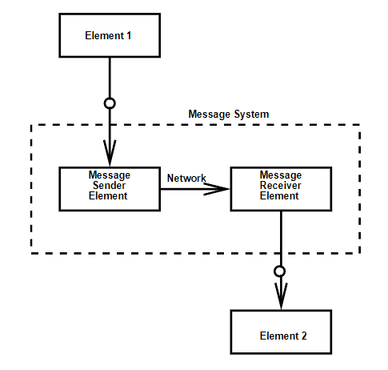

# 3A04 Software Design III 

## Table of Contents
- [Course Breakdown](#course-breakdown)
- [Last Year Final Exam](#last-year-final-exam)
- [Grading](#grading)
- [Textbook](#textbook)
- [SDLC V Model](#sdlc-v-model)
- [Code Structure](#code-structure)
- [Project Runtime Structure](#project-runtime-structure)
- [Software Management Structure](#software-management-structure)
- [Software Elements](#software-elements)
- [Tutorial 1 Jan 16, 2018](#tutorial-1-jan-16-2018)
- [Software Connectors](#software-connectors)
- [Iterative Refinement of an Architecture](#iterative-refinement-of-an-architecture)
- [Third Slide Set, Models](#third-slide-set-models)

## Day 1 Jan 5, 2018

- Fridays are for problem solving :relieved:

### Course Breakdown

1. Software requirements
  - Pre-reqs -> reqs -> Architecture design -> Coding -> Testing
2. Software architecture design space (types of software structures, software elements, sofware connectors)
3. Design Principles for sustainable systems
4. How to approach practical problems using architecture design

### Last Year Final Exam

5. Using appropriate design pricnciples, compare 2 designs in figure.
  Design A - interconnected, multi-directed, a lot of things depend on other things
  Design B - organized, singly directed, not a lot of interdependency
  
  Design B is better as it has low coupling high cohesion! :bowtie:
  
6. Build simple software that translates Fahrenheit to Celcius. Choose suitable architecture design.
    - not that hard :innocent:
    
8. AI system. Algorithm has uncertainty therefore we need specific architecture. What wil be the most suitable architecture?
  
9. Gives context for system, system to allow fire dept to follow fire situation in agricultural, forest, industrial areas. System will have sensors for each area.
    - choose appropriate software architecture
 
### Grading and Textboook
 
- Project
  - teams of 4-5 (not chosen by us :cold_sweat:)
  - need log book 
  - will appoint leader 
- Surprise 5-10 minute Quizzes :expressionless:
  - up to 6, can drop 1
- Midterm (Feb 26) worth 20%
- Exam
  - counts for (40 - 2* number of quizzes that count)% of your score
  - eg if 4 quizzes then (40 - 2*3)% = 34%
  - may be oral?
  
**Textbook**
Software Architecture and Design Illuminated
  
## Day 2 Jan 8, 2018

### Introduction to Software Architecture

#### What is Design
- can be seen in any human artefact and in nature
- objective and subjective
  - aesthetic (look and feel) vs functional (speed performance)
  - artistic or mathematical or both?
- decomposition of complex systems/artifacts is an aim of design

#### Design as a mathematical activity
- Construction of a deterministic finite automata that takes in strings of binary with even number of 0s and number of 1s is a multiple of 3
- **Design Process**: create a language to satisfy constraints
- L(M3) is an intersection of 2 languages L(M1) and L(M2) therefore we use product construction

Design coukd be viewed as an activity that translates an idea/goal into a blueprint for an artefact or a process that is fit for its envionment

## Day 3 Jan 10, 2018

- Group project: **identifying objects** :frog:
- good design in software reduces risks
- makes system traceable for implementation and testing

### SDLC V Model



### What is meant by Software Architecture
- blueprint for developing small and large systems based on requirement analysis
- highlights early decisions
- has set of constraints (space, time, budget)
- Considers separation of concerns
  - each software component hides something
- there are connectors between software components

:sleepy:

**Must be included in software architecture**
- specialization of software elements
- connection types
- set of constraints (space, time, budget)
- set of desired quality attributes (eg performance)

#### Architecture Style
- families of similar architectures
- represents the way elements are arranged, connections and interactions among elements, quality attributes, etc

#### System Architecture
- IEEE Std 1471 - "the fundamental organization of a system embodied in its components, their relationships to each other, and to the environment, and the principle guiding its design and evolution"

### Role of Software Architect
- system static partioning
- decomposing system into sub-systems
- establish dynamic control relationships between sub-systems
- quality attribute tradeoff analysis

## Day 4 Jan 12, 2018

**Discussion Day**

- software architecture can be given from several perspectives
  - software code units (elements are source, binary code, modules)
  - project's runtime structure (elements are threads, processes, transactions)
  - allocation structure (project management structure)
- each structure class uses different connectors and different performance attributes

:cry: :cry: **so hungry** :cry: :cry:
 
### Code Structure
- **module** : software component that hides a secret - big part of code structure
  - behaviour hiding modules
  - hardware hiding modules (hide communication between software and hardware)
    - eg robot's secret is its language
  - software hiding modules
    - have secrets like algorithms, data structures (can be generalized to 3 types - tuples, list, sets)
- amount of knowledge that component modules have of each other kept to minimum (**high cohesion low coupling**)
- information flow between compoenents is restricted to flow from method calls
- connectors in structures have:
  - direction - if module A invokes a method of module B then A -> B is connected
  - synchronization
    - asynchronous - operates independently
    - synchronous - process runs as result of other processes
  - sequence - some connectors must be used in particular sequence (label connector with sequence id)

 ## Day 5 Jan 15, 2018

- last week we began to look at 3 architectural views - code view, runtime view, management view

### 3 things in architecture
- we give many views that provide 3 things
  1. components
  2. connectors
  3. rationale for having the above to explain non-functional reqs

### Project Runtime Structure
- at runtime project can be **threads**, **processes**, **functional units** and **data units**
- these elements ay run on the same or multiple computers
- elements in code structures can implement or support multiple runtime elements (modules implement processes)
- several code structure elements may implement or support single runtime element (many threads in different code units)
- connectors at this level inherit atributes from their source-code counterparts
  - **multiplicity** - one element may be connected to multiple other elements if it needs to invoke methods of multiple elements at runtime
  - **distance and connection media** - two connected elements may communicate in the same process/thread/computer
    - eg communication by optical cable OR LAN to the media
  - **universal invokable** - protocol to communicate with an element
    - software protocol is a way of exchanging information eg bluetooth is 15 dif protocols
  - **self-descriptive** - allow external software system to invoke its target methods without pre-installation

### Software Management Structure
- ~~are we skipping this just because???~~
- used for project resource allocation

### Software Elements
- they have functions and are connected into dependency graphs through connectors
- each one has different synchronization and performance constraints
- some elements are re-entrant - usually more efficient since they avoid synchronization, therefore can be safely executed concurrently, they can be implemented by any thread or process

#### Basic Guidelines for runtime elements
1. business logics may not allow some elements to be reentrant since order of operations matters a lot when you have shared resources
2. if element is reentrant and multiple threads or processes may need to communicate with it, must run on separate threads or processes (thread safety)
3. if element has high multiplicity and performance is important to global system, use an application server for implementation
4. if heavy computations innvolved for deployment at particular location, consider using _cluster of processes_
  - architecture is master-slave but it will suffer from performance problem if a master is connected to like 1000 slave processors at one layer
    - if multiple layers it is mores manageable
  - size of cluster is determined by computation load and communication traffic

  

5. if element is assigned well-defined complex functions and similar off-the-shelf software exists and performance not critical then use **off the shelf solution**
6. complex system can be expanded into sub-system with its own elements and connectors
7. complex element can be transformed into sequence of layered elements
  - each layered element hides low-level system details from upper layers


8. complex element can be transformed into sequence of tiered elements (each interface must be well-defined)



## Tutorial 1 Jan 16, 2018

### Group Project Overview and Deadlines
- identification app for Android
- can be specific or general
- need 3 experts that guess what the thing is (experts must be disjoint, communicate with central forum)
- experts can say I don't know
- must use some sort of database to store results
- _keep a log book_

**Deadlines**
- Feb 9 - SRS Doc (list functional/nf reqs by business event)
- Mar 9 - Use Case Diagram and SRC Diagram, introduce classes
- Mar 30 - Code
- Apr 6 - Final

## Day 6 Jan 17, 2018

### Software Connectors
- in abstract form, connector indicates necessity during system execution for 1 element to send message to another elemnt
- if those 2 elements mapped to single process, connector could be mapped to local method invocation
- if those 2 elements mapped to two different processes on same computer, then connector could be mapped to local message queue or an operating system pipe
- if those 2 elements mapped to 2 different computers then remote method invocation or Web service invocation can be used

#### Software Connector Attributes
- Synchronization mode - eg sempaphores, blocking/non-blocking
- Initiator
  - makes request for communication
  - one-initiator connectors - client initiates communication
  - two-initiator connectors - if they are non-blocking
  - callback support - requires two-initiator connectos
- Information carrier perspective
  - what medium to use
    - variable (2 threads in same process)
    - environment resource (register, pipes, file, local message queues)
    - method invocation and message
- Implementation type 
  - protocol-based can implement multiple operations
  - signature-based methods implemnt **one** type of operation
- Active Time
  - when you make connection to program
  - event-driven - when something becomes active, something happens (reactive systems like thermostat)
- Connective Span (Perspective)
  - scope: local or global (network)?

  

- Connector fan-out
  - is it a one-to-one connector or many-to-many
  - one-many have more important impacts on implementation
- Connector environment
  - homogeneous (same programming language and software framework and same OS)
  - heterogeneous

### Iterative Refinement of an Architecture
- third part of architecture (elements, connectors, now **iterative refinement**)
- givem project spec, an absract high level software architecture is proposed (elements + connectors)
- goes through multiple refinement phases

#### Example steps of implementing an architecture
1. standalone, local system
  
2. remote system
  
3. refine system by adding protocols
  
4. layered architecture
  

### Models
**Third slide set**

- Will discuss the 4 + 1 model for architecture
- architecture has components, connections and interactions between these components
- need to specify configuration toplogy
  - **Bus** is an infrastructure or more formally, a sofware system
- the bad thing about the bus infrastructure is that if a single part of the system fails, the inter-related system makes it so that the whole thing fails (most of the time)
  - **Star** architecture has a central node with things coming into it
    - not that much differnet from bus
  - **C4/K4** is like a square with an X in the middle
    - aka C<sub>N</sub>, every edge has N-1 connections
    - the good thing is: if one of the nodes fails the system still functiona
    - bad thing: it is complex so it might require more maintenance as well as redundant information

#### Ways to describe software architecture
  - formally in ADL and informally in UML
  - Box-and-line diagram
    - describe business concept
    - lines indicate relationshp among components (unlike UML)
    - lines may refer to dependancy, control flw, data flow
    - lines may be associated with arrows to indicate process direction and sequence
  - UML is one of the Object-Oriented solutions for software modeling and design
  - "4+1" view is another way to show different views wit different concerns for dif aspects (F + NF reqs)


## Day 7 Jan 19, 2018

### 4 plus 1 Model
- has 5 views
  1. Logical View - identifies software modules and their boundaries
  2. Process View - addresses non-functional requirements and performance at runtime
  3. Development View - organizes software units appropriately
  4. Physical View - specifies physical software, hardwar, network configuration, installation and deployment
  5. Scenario/User Interface View - most important, gives look and feel


### UML for Software Architecture
- UML is a graphical language for visualizing, specifying, constructing and documenting software artifacts aka **system's blueprints**
- system within environment has interactions, actors, initiators for events
- **event** - initializes set of interactions
- **business event** - is independent from the system. It is from the environment to the system. has an initiator
  - happening that the system has to deal with outside of the system is followed by interaction between environment and system
- **scenario** - series of interactions between system and environment triggered by business event
- for every business event, there are view points, each view point is associated with a scenario
 
**Scenario View**

- BE<sub>2</sub>
  - VP1
    - Scenario
  - VP2
    - Scenario
    - ```Scenario has system response and actor and system - should end with system```

...

- BE<sub>n</sub>


