# 3DX4 Dynamic Systems and Control

## Table of Contents
- [Grading](#grading)
- [Textbook](#textbook)
- [Software](#software)
- [What is a Control System](#what-is-a-control-system)
- [System Configurations](#system-configurations)
- [Transient and Steady-State Response](#transient-and-steady-state-response)
- [Stability](#stability)
- [Lab 1 and Terminology](#lab-1-and-terminology)
- [PID Controller](#pid-controller)
- [Laplace Transforms](#laplace-transforms)
- [Laplace Table](#laplace-table)
- [Transfer Function](#transfer-function)
- [Laplace and PartFrac Examples](#laplace-and-partfrac-examples)
- [Some MatLab Commands](#some-matlab-commands)
- [Stability Analysis](#stability-analysis)
- [Impedence, Electric Network Transfer Function, and Circuits](#impedence-electric-network-transfer-function-and-circuits)
- [Kirchhoff's Current and Voltage Law](#kirchhoffs-current-and-voltage-law)
- [Mesh Analysis](#mesh-analysis)
- [Cramer's Rule](#cramers-rule)
- [Nodal Analysis](#nodal-analysis)
- [Operational Amplifiers](#operational-amplifiers)
- [Noninverting Op Amp](#noninverting-op-amp)
- [Mechanical Systems and their Components](#mechanical-systems-and-their-components)
- [Translational System](#translational-system)
- [Translational System Example](#translational-system-example)
- [Rotational Systems](#rotational-systems)
- [Rotational Mechanical System with Gears](#rotational-mechanical-system-with-gears)

## Day 1 Jan 4, 2018

### Grading

- Assignments/Quizzes 10%
- Labs 10% (ITB 235)
- Midterm 30%
- Exam 50%

\*_8 or 9 quizzes, drop lowest 1 or 2_\*

### Textbook
- Control Systems Engineering - N. Nise (7th Edition)

### Software
- Matlab simulink
- Labview

[Link to Matlab and Labview](https://virtualdesktop.cas.mcmaster.ca/)

### What is a Control System
- simplest form - output provided for a given input

- unity feedback - input 1 output 1

#### Why Need?
- power amplification
- remote control
- convenience on input
- compensation for disturbances - i.e slope of ball, air, door opening
- improve system speed, accuracy, repeatability, performances

### System Configurations

#### Open-Loop System


- open loop control (cheap, not robust)
- no way of knowing if expected output is actual output
- sensitive to disturbances and hard to control

#### Closed-Loop System


- allows you to check output
- measuring the output response of a system and comparing it to a reference turns open loop system into closed loop

### Transient and Steady-State Response


_transient = in transition_
- transient response tradeoff
	- if you get where you want really fast (high gain)
	- oscillates around point and doesn't settle
	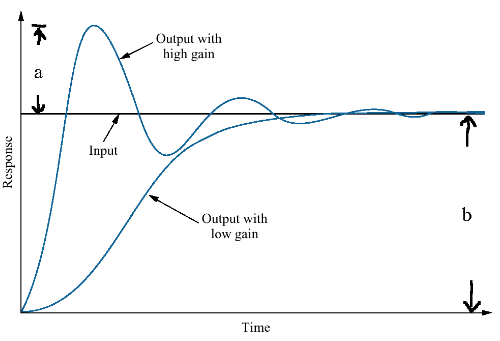
	- low gain: doesn't overshoot
```	
Percent overshoot = a/b * 100%
a = x-axis to highest point
b = x-axis to lowest point
```

### Stability

```
Total response = Natural response + Forced response
```

- Natural response (homogeneous) - evolution of system due to initial conditions
- Forced response (particular soln) - Evolution of system due to input
- bounded input doesn't create bounded output :dizzy_face:
- system has to be stable

#### Control Objectives
1. Stabilize the system
2. Produce desired transient response
3. Decrease/eliminate steady state error
4. Make system robust to withstand disturbances and variations in parameters
5. Achieve optimal performance

## Day 2 Jan 5 2018

### Lab 1 and Terminology
- 70% of problems can be solved with PID
- In Lab 1, you design a PID controller to control position of a DC electric motor's shaft. Criteria for the controller's step response are
	- settling time less than 0.04s
	- overshoot less than 16%
	- system is free of steady-state error

#### Proportional Control System 
- calculating controlled output to make motor go proportionally faster
- open loop version: apply step voltage to motor
   - through feedback, you can put more energy into the system cranking up the gain enough so that it doesn't go unstable or start to oscillate
- makes things go faster by feeding error signal directly to plant

#### Integral Control System
- feeds integral of error to plant
- keeps the motor moving in theory
- however, not always how it works in practicality therefore, a step voltage doesnt mean anything
- therefore you need to integrate over time so the voltage becomes big
- integral gain gets rid of steady state error

#### Derivative Control System
- feeds derivative of error to plant
- prevents overshoot or gets desired amount of overshoot
- later we will learn the theory to predict the control of systems
- in practice, requires a lot of tweeking and fine tuning 
- improves performance of system

#### Underdamped Response Specifications
c<sub>final</sub> = lim<sub>t->inf</sub>c(t)

**c(t)** is the output

1. **Rise time** is the time for output to go from 10% (0.1c<sub>final</sub>) to 90% (0.9c<sub>final</sub>)
2. **Peak time** - time required to reach first and largest peak
3. **Percent overshoot** - %OS percentage that output overshoots final value

%OS = ((c<sub>max</sub> - c<sub>final</sub>)/c<sub>final</sub>)*100%

4. **Settling time** - is it close enough to do whatever we have to do? (settles within +-2% ofc<sub>final</sub>

### PID Controller
- transfer function of proportional integral derivative controller


- first term is proportional, second integral.. etc
- system has 2 zeros plus a pole at origin

#### Block Diagram Representation of System
- can use differential equations to represent relationship between input r(t) and output c(t) or a block diagram of subsystems

### Laplace Transforms
- modelling in the frequency domain entails laplace transforms
- can do by hand or using MatLab
- helps us understand dynamic behaviour of processes
- time domain vs laplace domain (s-domain)
- laplace is best used for stability analysis, controller design, block diagrams)
- **Laplace Transform** - going from time domain differential equation to laplace algebraic equation 
- **Inverse Laplace transform** - algebraic equation to time domain solution

**_Definition_**


- s = σ + jω is th Laplace transform variable
- no information for time less than zero so we multiply f(t) by u(t) 
- but its ok if you write L(1/s^2) = t

### Laplace Table


#### Important properties of laplace
- linearity - can bring constants out
- differentiation: limit as t goes to zero
	- laplace of derivative is s*F(s) - f(0-)
- frequency shifting: if you multiply by exponential e<sup>-at</sup> and take laplace, you replace F(s) by F(s+a)

#### Laplace Transform Theorems


- #11 could have poles on left side and maybe one at origin but if it doesnt it violates condition and is unstable

### Transfer Function
- the box in the middle that transforms input
- n<sup>th</sup> order LTI differential equation is of the form:
	
- c(t) is output, r(t) is input, G(S) = C(s)/R(s)

#### Example
```
Tp*dc(t)/dt + c(t) = kp*r(t)
------take laplace-----------------
L(Tp*dc(t)/dt + c(t)) = L(kp*r(t))
-------linearity---------------------
Tp*L(dc(t)/dt) + L(c(t)) = kp*L(r(t))
--------differentiation----------------
Tp*(s*C(s) - c(0)) + L(c(t)) = kp*L(r(t))
------apply laplace, assume c(0) = 0----
Tp*s*C(s) + C(s) = kp*R(s)

--------find G(S)-----------------------
G(s) = C(s)/R(s) = kp/(Tp*s + 1)
```

#### Inverse laplace transform
	- 

#### Partial Fraction Expansion
- since the system model will most likely of the form F(s) = N(s)/D(s)
   ```
		s^2 + 2s - 3		       			
	F(s) = ----------------
		s^5 + s^4 - s - 1	   	   

		= s^2 + 2s - 3
		  -----------------
		(s-1)(s+1)^2(s^2+1)

		= A      B       C        Ds + E
		----- + ----- + ----- +  -------
		s-1     s+1    (s+1)^2   s^2 + 1
	```
   - expect a bunch of dif terms
   - pole zero cancellayion, when both denom and numerator have same pole
   - so when you expand the term with s - 1 wont be there

## Day 3 Jan 9, 2018

### Laplace and PartFrac Examples

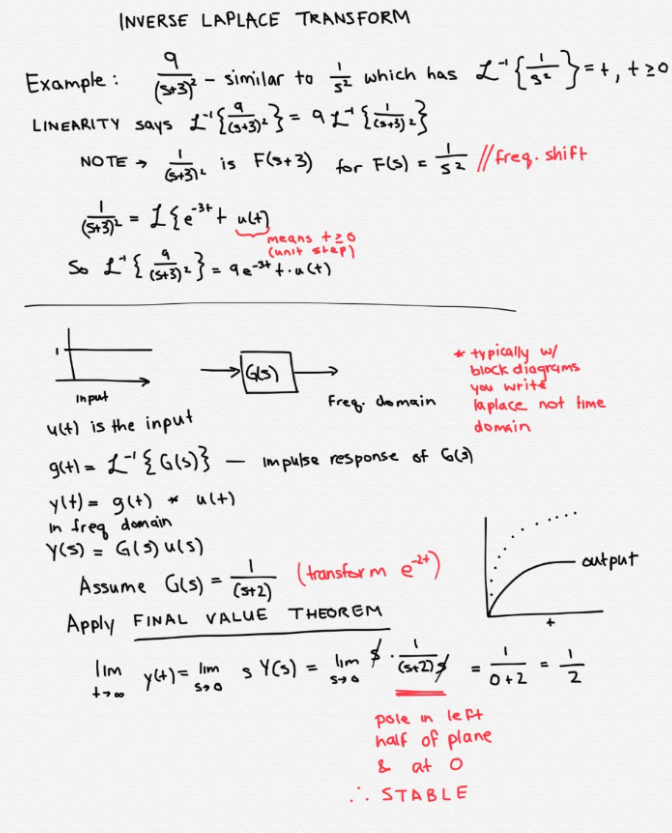

- Final Value Theorem is a quick way to look at the system in the long run
- we know the above is a first order system therefore there are no oscillations

#### Partial Fraction Expansion
- take transfer function and decompose it to compare to the table
- refer to [Cover Up Method](#cover-up-method)


### Some MatLab Commands
- define F
- define ```syms s, t```, etc
- ```ilaplace``` - computes laplace
- ```partfrac(F)``` - gets partial fractions
- ```pretty(x)``` - makes it pretty

#### Partial Fractions Decomposition
1. Divide if improper, degree of numerator is denominator
	- do long division
2. Factor denominator
3. Linear factors
	- if you have (s+a)<sup>m</sup>, include A/(s+a) ... A<sub>m</sub>/(s+a)<sup>m</sup>
4. Quadratic factors
5. Determine unknowns

#### Cover Up Method
- neat lil trick for the bois back home
- say you're solving for A
	- look at its denominator and find its pole
	- then cover up that denominator from original
	- sub in the value of the pole and answer shall be A :information_desk_person:

## Day 4 Jan 11, 2018

### Stability Analysis
- if you have a complex polynomial N(s) and D(s)
- after expansion, we refer to roots of D(s) as poles
- if you have some polynomial in matlab, you can do roots([a b c]) with the coefficients of your polynomial ax^2 + bx + c
- ```s = tf('s')``` - makes it so that s is the variable in transfer function
- can find poles of G(s), a transfer function, by doing the above command and ```pole(G)```
- if you have distinct poles p1, p2, p3 then you end up with A<sub>1</sub>e<sup>-p<sub>1</sub>t</sup> + A<sub>2</sub>e<sup>-p<sub>2</sub>t</sup> + ... A<sub>n</sub>e<sup>-p<sub>n</sub>t</sup>
- between G(s) = 1/(s+1) and 1/(s-1), the second one is unstable as it comes to a finite value

#### Real and Imaginary Roots
If we have poles at s = -p<sub>i</sub> = - σ<sub>i</sub> +- jω<sub>i</sub>
- if ω<sub>i</sub> = 0 then pole is strictly real 
- if σ<sub>i</sub> > 0, then pole is in left side of imaginary plane and response decreasess to zero over time - system is **stable**
- if ω<sub>i</sub> = 0 and σ<sub>i</sub> < 0 then pole is in right side of imaginary plane, response increases over time and system is **unstable**
- sometimes you want an oscillation, can tune a system so poles are on imaginary axis
- if only pure imaginary roots, technically considered stable - called **marginally stable** because its impulse response doesn't blow up - σ<sub>i</sub> = 0 and ω<sub>i</sub> != 0
	- this system has no damping

##### Example of Marginally Stable
- poles at -3 and +3 on j (imaginary) axis with G(s) = 1/(s<sup>2</sup> + 9)
- system will blow up with a repeating periodic impulse input
- bounded input to break system: hit it with oscillation of 3 rad/s

#### Complex Roots
Again, if we have poles at s = - σ<sub>i</sub> +- jω<sub>i</sub>
- if ω<sub>i</sub> and σ<sub>i</sub> both != 0 we have complex roots

```
Unstable Example
G = 1/((s-2 +j*3)*(s-2-j*3))

>> impulse(G)
>> step(G)

starts oscillating a lot and doesn't plateau

----------
Stable Example
G = 1/((s+2 +j*3)*(s+2-j*3))

>> impulse(G)
>> step(G)

some oscillation, then plateaus out
```

#### Time Functions associated with s-plane
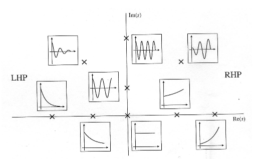
- in theory, turning up the gain and spending infinite energy will make system respone large
- on s-plane, things on j plane appear in complex conjugates

### Impedence, Electric Network Transfer Function, and Circuits
- impedence is laplace generalization of resistance
- need Ohm's law: ```v(t) = Ri(t)```
	- Laplace ```V(s) = R!(s)```
- impledence: ```Z(s) = V(s)/I(s) = R```
- admittance: ```Y(s) = !(s)/V(s) = 1/R = G```

#### Impedence of Inductor
- voltage-current relation of inductor
- ```v(t) = L di(t)/dt```
- assume 0 condition when performing Laplace to find transfer function
- given this cicruit, replace L by Ls
- 

#### Impedence of Capacitor
- 1/C*S

#### Summary of Circuit Elements
- things with very low voltage signal use active components - eg cellphone
- active components inject energy unlike passive componenets (without internal energy source)


#### Equivalent Resistance and Impedence
- resistance in serial can be replaced by equivalent resistor R<sub>s</sub> = R<sub>1</sub> + .. + R<sub>N</sub>
- same with impedence: Z<sub>s</sub> = Z<sub>1</sub> + .. + Z<sub>N</sub>
- in parallel resistors are R<sub>p</sub><sup>-1</sup> = R<sub>1</sub><sup>-1</sup> + .. + R<sub>N</sub><sup>-1</sup>
- same with imepedence: Z<sub>s</sub><sup>-1</sup> = Z<sub>1</sub><sup>-1</sup> + .. + Z<sub>N</sub><sup>-1</sup>

## Day 5 Jan 12, 2018

### Kirchhoff's Current and Voltage Law

#### Current Law
- point of connection between 2 or more circuit elements is referred to as **node**
- current flows into node considered positive, leaving the negative node
- _KCL_ says that the algebraid sum of currents entering any node is 0
- 5 going in, i going in, -3 going out and -2 going out gives a sum of 0
- 

#### Voltage Law
- algebraic sum of voltages around closed loop/path is zero
- to find voltage across op resistor, we're going from plus to minus so subtract, therefore it's 3 V
- 

#### Written Example
- finding transfer function V<sub>c</sub>(s)/V(s)
- voltage across capacitor varies with integral of v so c becomes 1/cs
- current = the voltages (in series) + Ls + Lr + 1/Cs
- voltage = current * impedence

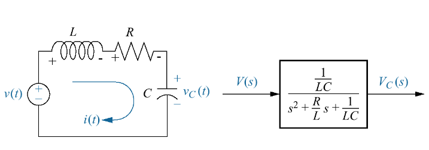


### Mesh Analysis
- if you know the currents in the circuit then you can figure out anything else because current * impedence
- if you know the voltages, same thing because you can do voltage/impedence

#### Mesh Example
 

 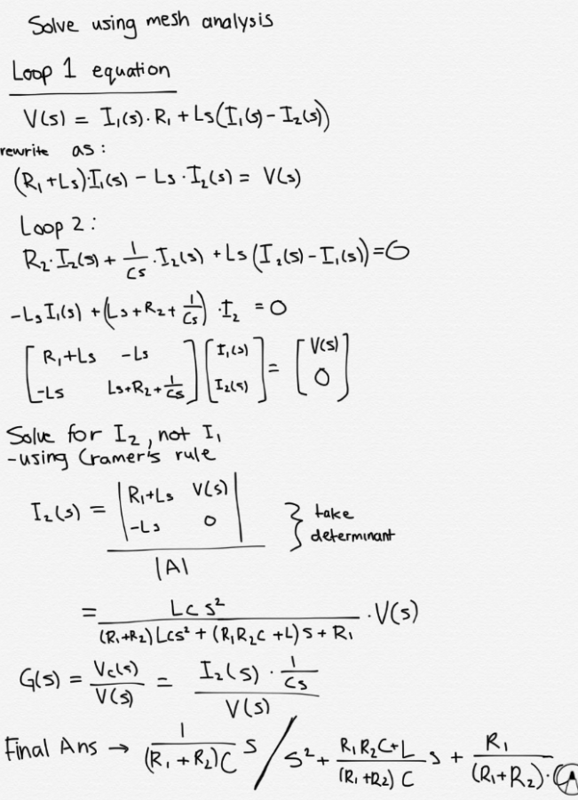

### Cramer's Rule
- if Ax = B is a system of N linear equations and you wanna solve for N unknowns such that det(A) != 0, then system has unique solution and you can solve for x
- replace column of A<sub>n</sub> by column of B 


- brute force mechanical way of solving matrix
- probably won't have to do a matrix bigger than 3x3
- might wanna put formulars on cheat sheet 

**2 pages of notes allowed on midterm**

### Nodal Analysis
- alternative to mesh analysis
- start out with circuit
- replace elements with their laplace equivalent
- L -> Ls, C -> Cs, etc
- use kirchhoff's current law for equations for unknown voltages

#### Nodal example

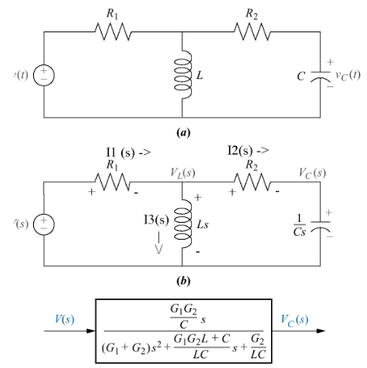

## Day 6 Jan 16, 2018

***Midterm during week before reading week\***

### Operational Amplifiers
- resistors, conductors - passive elements that don't put energy into system
- you don't get as much out of these systems
- if you want large gain in system, you need to amplify with _active_ components
- following characteristics
	1. v0(t) = A(v2(t) - v1(t))
	2. high input impedence Zi = infinity
	3. low output impedence Z0 = 0
	4. the more current you draw, still basically same voltage: high constant gain A = infinity
- ideal Op Amp assumptions

	- input voltages are equal: v1(t) = v2(t)
	- no current flows into inputs i+ = i- = 0

#### Inverting Op Amps
- 2 marks for writing down voltage - voltage at ground = 0, V1(x) = 0
	- current flowing in is 0
	- relation between i1 and i2: i1 = - i2
	- if A is very large gain, force of the two voltages is equal in example below
	- since v1 is approx 0, value of current i1 = (input - 0)/zi
	- i2 = (Vout/z2)
	- This gives the transfer function - V0(s)/Vi(s) = -Z2(s)/Z(s)
	- should write down this configuration on your cheat sheet

	

#### Example
Find transfer function Vo(s)/Vi(s) of the following:


- Vo(s)/Vi(s) = -Z2(s)/Z1(s), both of which we need to determine 
- using parallel inductance, Z1(s)<sup>-1</sup> = C<sub>1</sub>s + R1<sup>-1</sup>
- Z1(s) = inverse of above
- using serial inductance rule, Z2(s) = R2 + C<sub>2</sub>s<sup>-1</sup>
- through substitution we can now find the transfer function
- multiplying input by s implies derivative
- division by s corresponds to integral
- putting those 3 terms together gives you PID controller
- Gc(s) = K3(s^ + K1s/K3 + K2/K3)/s (as seen earlier)

### Noninverting Op Amp
- want input to go into positive terminal (unlike previous example)
- we know that Vo(s) = A(Vi(s)-V1(s))

- voltage divider circuit


**written example**

### Mechanical Systems and their Components
- once in laplace form, we just know transfer function
- there are 2 types of mechanical systems, **translational** and **rotational**

#### Mass Component
- we wish to find transfer function Z<sub>m</sub>(s) = F(s)/X(s)
- Newton's second law of motion ```{sum} f = ma```
- laplace forms for position f(t) = Ma(t) is F(s) = Ms<sup>2</sup>X(s)
- if you know position, multiply by s to get velocity **(assignment q)**

#### Viscous Damper
- the things that adds friction to doors so they don't swing open like crazy
- friction is proportional to velocity
- middle part is typically moving through some liquid
- f(t) = f<sub>v</sub>v(t)
- taking Laplace we get F(s) = f<sub>v</sub>sX(s) -- ratio of force to position


#### Spring Constant
- K
- f(t) = Kx(t)
- in laplace: F(s) = KX(s)
- impedence of that Zm(s) = F(s)/X(s) = K
- F(s) = K/s*V(s)
- the derivative/velocity is then K/s

#### Summary of Translational Elements


### Translational System
- to find transfer function
	- draw free-body diagram
	- use f = ma to create force equations
	- in example there is force acting to right and force Kx as well as fv*x
	- the m*a component will be left over
	- assume positive direction of travel is to the right
	- Kx and fvx pulling you back

	

	- b) is laplace form

#### Two degrees of motion
- state space systems, state of a system in the future
- only care about position and velocity
- number of equations of motion = number of linerly independent motions
- in system below, there is a viscous damper between the two masses so they can independently
	- they interact but if one moves the other can remain stable
	- therefore 2 degrees of freedom, one for each mass

	

- Find transfer function of above by using principle of superposition
- works on linear systems
1. draw free-body diagram of one object by holding the other object still
2. draw free-dbody diagram not olding other object still
3. total force acting on original object is superposition of forces

**M1** 
- nail M2 to the floor
- if M1 moves right, viscous damper pushes you back, spring between gets compressed and spring on left getting stretched AND coefficient of friction AND m*a


- a) is fbd if only m1 moves independent of m2
- b) is is m1 when m2 moves
- c) is the superposition of all forces

## Day 7 Jan 18, 2018

### Translational System Example
- find transfer function X(s)/F(s)

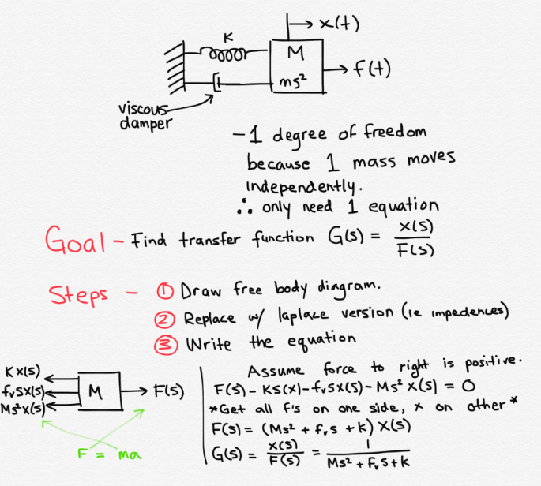

- moving on to more complex example

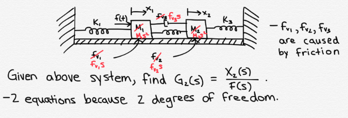

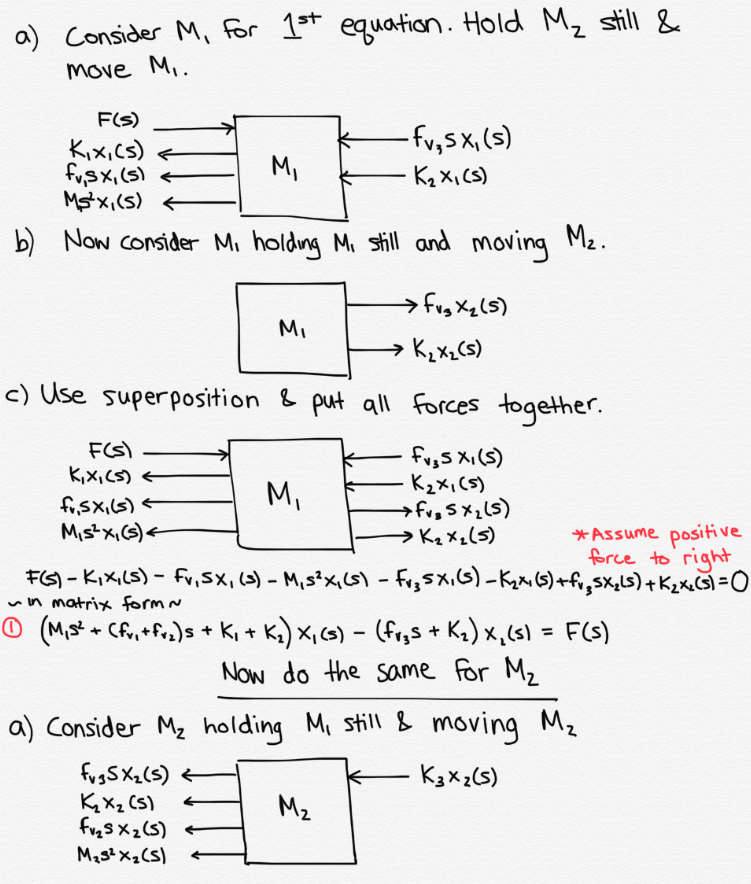

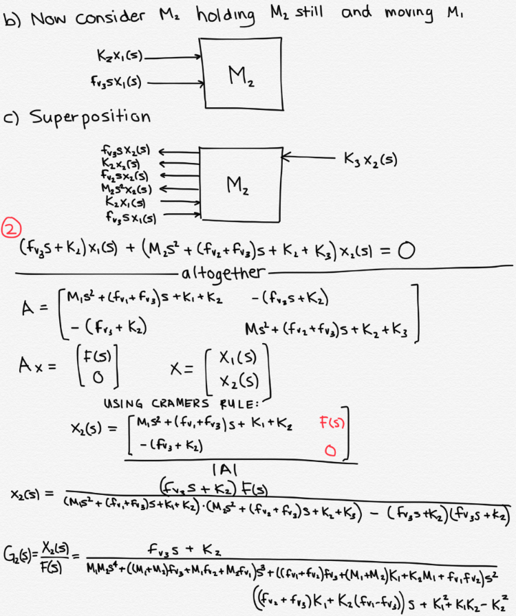

## Day 8 Jan 19, 2018

- when asked for transfer function for position from velocity - multiply by 1/s

### Rotational Systems
- x(t) --> θ(t) 
- v(t) --> ω(t) angular velocty
- f(t) --> T(t) torque
- M --> J moment of inertia
	- impedence is Js^2
- fv --> D viscous damper
	- impedence is Ds
- K --> K
	- impedence is K

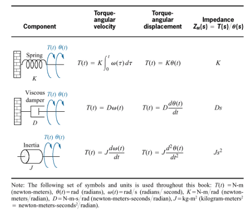

#### Rotational Degress of Freedom
- which mass you can rotate independently
- in diagram, there are 2 degrees of freedom


#### Homework next week
- if you have something that looks like


- you have additional degree of freedom. add in mass of size 0

#### Writing Equations of Motion
- use same principle as translational motion
- Consider J1 holding J2 still, consider J1 holding J1 still and add them
- Do the same for J2 and find the sum of torquess

## Day 9 Jan 23, 2018

**go back and read slides 65-71**

### Rotational Mechanical System with Gears

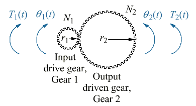

θ<sub>2</sub>/θ<sub>1</sub> = N<sub>1</sub>/N<sub>2</sub> =
T<sub>1</sub>/T<sub>2</sub>

So T1\*N2 = T2\*N1

- assume negiligable inertia and dampening


