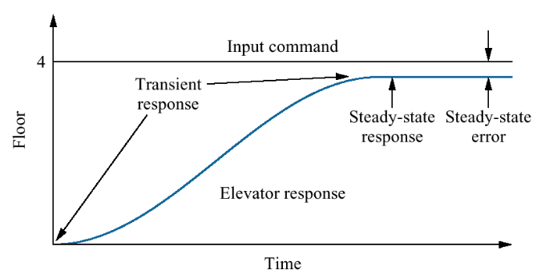
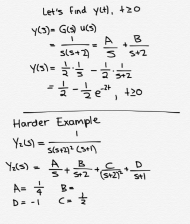
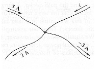
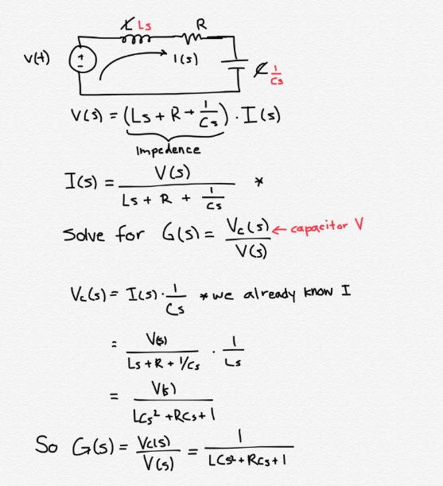
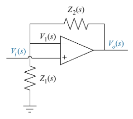
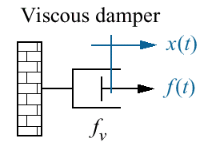
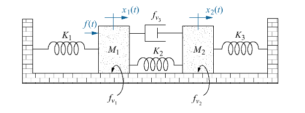

# 3DX4 Dynamic Systems and Control

## Table of Contents
- [Grading](#grading)
- [Textbook](#textbook)
- [Software](#software)
- [What is a Control System](#what-is-a-control-system)
- [System Configurations](#system-configurations)
- [Transient and Steady-State Response](#transient-and-steady-state-response)
- [Stability](#stability)
- [Modelling in the Frequency Domain](#modelling-in-the-frequency-domain)
- [Written Examples](#written-examples)
- [MatLab Commands](#matlab-commands)
- [Partial Fractions Decomposition](#partial-fractions-decomposition)
- [Stability Analysis](#stability-analysis)
- [Time Functions ](#time-functions-)
- [Electric Network Transfer Function](#electric-network-transfer-function)
- [Equivalent Resistance and Impedence](#equivalent-resistance-and-impedence)
- [Kirchhoff's Current Law](#kirchhoffs-current-law)
- [Kirchhoff's Voltage Law](#kirchhoffs-voltage-law)
- [Mesh Analysis](#mesh-analysis)
- [Cramer's Rule](#cramers-rule)
- [Nodal Analysis](#nodal-analysis)
- [Operational Amplifiers](#operational-amplifiers)
- [Noninverting Op Amp](#noninverting-op-amp)
- [Mechanical System](#mechanical-system)
- [Mass Component](#mass-component)
- [Translational](#translational)

## Day 1 Jan 4, 2018

### Grading

- Assignments/Quizzes 10%
- Labs 10% (ITB 235)
- Midterm 30%
- Exam 50%

\*_8 or 9 quizzes, drop lowest 1 or 2_\*

### Textbook
- Control Systems Engineering - N. Nise (7th Edition)

### Software
- Matlab simulink
- Labview

[Link to Matlab and Labview](https://virtualdesktop.cas.mcmaster.ca/)

### What is a Control System
- simplest form - output provided for a given input

- unity feedback - input 1 output 1

#### Why Need?

- power amplification
- remote control
- convenience on input
- compensation for disturbances - i.e slope of ball, air, door opening
- improve system speed, accuracy, repeatability, performances

### System Configurations

#### Open-Loop System


- open loop control (cheap, not robust)
- no way of knowing if expected output is actual output

#### Closed-Loop System


- allows you to check output

### Transient and Steady-State Response


_tansient = in transition_
- transient response tradeoff
	- if you get where you want really fast (high gain)
	- oscillates around point and doesn't settle
	
	- low gain: doesn't overshoot
```	
overshoot = a/b * 100%
a = x-axis to highest point
b = x-axis to lowest point
```

### Stability

```
Total response = Natural response + Forced response
```

- Natural response (homogeneous) - evolution of system due to initial conditions
- Forced response (particular soln) - Evolution of system due to input
- bounded input doesn't create bounded output :dizzy_face:
- system has to be stable

## Day 2 Jan 5 2018

### Modelling in the Frequency Domain

- Laplace Transform
- do by hand and by matlab

#### Lab 1: Compensator Terminology

- 70% of problems can be solved with PID

##### Proportional Control System 

- calculating controlled output to make motor go proportionally faster
- open loop version: apply step voltage to motor
   - through feedback, you can put more energy into the system cranking up the gain enough so that it doesnt go unstable or start to oscillate
- makes things go faster

##### Integral Control System

- keep the motor moving in theory
- however, not always how it works in practicality therefore, a step voltage doesnt mean anything
- therefore you need to integrate over time so the voltage becomes big
- integral gain gets rid of steady state air  
- gets ready of steady state air

##### Derivative Control System
- prevents overshoot or get desired amount of overshoot
- later we will learn the theory to predict the control of systems
- in practice, requires a lot of tweeking and fine tuning 
- basically helps to reduce overshoot and improve performance of system

##### More on Lab 1 - underdamped response specifications

1. Rise time is the time for output to go from 10% (0.1Cfinal) to 90% (0.9Cfinal)
2. peak time - time required to reach first and largest peak
3. percent overshoot - %OS percentage that output overshoots final value

```
%OS = ((Cmax - Cfinal)/Cfinal)*100%
``` 
4. settling time - is it close enough to do whatever we have to do? (settles within plus or minus 2% of Cfinal

#### PID Controller

- transfer function of proportional integral derivative controller
```
Gc(s) = K1 + K2/s + K3s = (K3(s^2+(K1/K3)s+K2/K3)/s
```

- first term is proportional, second integral.. etc

#### Block Diagram Representation of System

#### Laplace Transform Review

- time domain vs laplace domain
- laplace is best used for stability analysis, controller design, block diagrams
   - polynomial A divided by polynomial B
   - converts diferential equations (time domain) to algebraic (s-domain)

_Definition_ 


-  = Laplace transform variable
- no information for time less than zero so we multiply f(t) by u(t) 
- but its ok if you write L(1/s^2) = t

##### Common Laplace Transforms


##### Important properties of laplace

- linearity
- differentiation: limit as t goes to zero
- frequency shifting: if you multiply by exponential e<sup>-at</sup> you replace F(s) by F(s+a)

##### Laplace Transform Theorems


- #11 could have poles on left side and maybe one at origin but if it doesnt it violates condition and is unstable

##### Transfer Function

- n<sup>th</sup> order LTI differential equation is of the form a<sub>n-1</sub>*d<sup>n-1</sup>c(t)/dt<sup>n-1</sup> + ... +
a<sub>0</sub>c(t)
- c(t) is output, r(t) is input
- Take Laplace, C(s)/R(s) = G(s)
- example with differential equation can turn into first order system
- inverse laplace transform
	- 
- partial fraction expansion 
   ```
		s^2 + 2s - 3		       			
	F(s) = ----------------
		s^5 + s^4 - s - 1	   	   

		= s^2 + 2s - 3
		  -----------------
		(s-1)(s+1)^2(s^2+1)

		= A      B       C        Ds + E
		----- + ----- + ----- +  -------
		s-1     s+1    (s+1)^2   s^2 + 1
	```
   - expect a bunch of dif terms
   - pole zero cancellayion, when both denom and numerator have same pole
   - so when you expand the term with s - 1 wont be there

## Day 3 Jan 9, 2018

### Written Examples


- Final Value Theorem is a quick way to look at the system in the long run
- we know the above is a first order system therefore there are no oscillations

#### Partial Fraction Expansion
- take transfer function and decompose it to compare to the table
- refer to [Cover Up Method](#cover-up-method)




### MatLab Commands
- define F
- define ```syms s, t```, etc
- ```ilaplace``` - computes laplace
- ```partfrac(F)``` - gets partial fractions
- ```pretty(x)``` - makes it pretty

### Partial Fractions Decomposition
1. Divide if improper, degree of numerator is denominator
	- do long division
2. Factor denominator
3. Linear factors
	- if you have (s+a)<sup>m</sup>, include A/(s+a) ... A<sub>m</sub>/(s+a)<sup>m</sup>
4. Quadratic factors
5. Determine unknowns

#### Cover Up Method
- neat lil trick for the bois back home
- say you're solving for A
	- look at its denominator and find its pole
	- then cover up that denominator from original
	- sub in the value of the pole and answer shall be A :information_desk_person:

## Day 4 Jan 11, 2018

### Stability Analysis
- if you have a complex polynomial N(s) and D(s)
- after expansion, we refer to roots of D(s) as poles
- if you have some polynomial in matlab, you can do roots([a b c]) with the coefficients of your polynomial ax^2 + bx + c
- ```s = tf('s')``` - makes it so that s is the variable in transfer function
- can find poles of G(s), a transfer function by doing the above command and ```pole(G)```
- if you have distinct poles p1, p2, p3 then you end up with A<sub>1</sub>e<sup>-p<sub>1</sub>t</sup> + A<sub>2</sub>e<sup>-p<sub>2</sub>t</sup> + ... A<sub>n</sub>e<sup>-p<sub>n</sub>t</sup>
- between G(s) = 1/(s+1) and 1/(s-1), the second one is unstable as it comes to a finite value
- if ω<sub>i</sub> = 0 then pole is strictly real and corresponds to 
- if σ<sub>i</sub> then pole is in left side of imaginary plane and response decresaes to zero over time - system is stable

#### Real and Imaginary Roots, Stability Analysis
- if ω<sub>i</sub> = 0 and σ<sub>i</sub> < 0 then pole is in right side of imaginary plane, response increases over time and system is unstable
- sometimes you want an oscillation, can tune a system so poles are on imaginary axis
- if only pure imaginary roots, technically considered stable - called marginally stable because its impulse resposne doesn't blow up - σ<sub>i</sub> = 0 and ω<sub>i</sub> != 0
	- this system has no damping

#### Example of Marginally Stable
- poles at -3 and +3 on j (imaginary) axis with G(s) = 1/(s<sup>2</sup> + 9)
- system will blow up with a repeating periodic impulse input
- bounded input to break system: hit it with oscillation of 3 rad/s

#### Complex Roots
- if ω<sub>i</sub> and σ<sub>i</sub> both != 0

```
Unstable
G = 1/((s-2 +j*3)*(s-2-j*3))

>> impulse(G)
>> step(G)

starts oscillating a lot and doesn't plateau

----------
Stable
G = 1/((s+2 +j*3)*(s+2-j*3))

>> impulse(G)
>> step(G)

some oscillation, then plateaus out
```

### Time Functions 

- in theory, turning up the gain and spending infinite energy will make system respone large
- on s-plane, things on j plane appear in complex conjugates

### Electric Network Transfer Function
- impedence is laplace generalization of resistance
- need Ohm's law: ```v(t) = Ri(t)```
- impledence: ```Z(s) = V(s)/I(s) = R```
- admittance: ```Y(s) = !(s)/V(s) = 1/R = G```

#### Impedence of Inductor
- voltage-current relation of inductor
- ```v(t) = L di(t)/dt```
- assume 0 condition when performing Laplace to find transfer function
- given this cicruit, replace L by Ls
- 

#### Impedence of Capacitor
- 1/C*S

#### Summary of Circuit Elements
- things with very low voltage signal use active components - eg cellphone
- active components inject energy unlike passive componenets (without internal energy source)

### Equivalent Resistance and Impedence

**Example**
- Simplify circuit to get 6 ohm resistance for left and 12 for right

## Day 5 Jan 12, 2018

### Kirchhoff's Current Law
- point of connection between 2 or more circuit elements is referred to as **node**
- current flows into node considered positive, leaving the negative node
- _KCL_ says that the algebraid sum of currents entering any node is 0
- 5 going in, i going in, -3 going out and -2 going out gives a sum of 0
- 

### Kirchhoff's Voltage Law
- algebraic sum of voltages around closed loop/path is zero
- to find voltage across op resistor, we're going from plus to minus so subtract, therefore it's 3 V
- 

#### Example
- finding transfer function
- voltage across capacitor varies with integral of v so c becomes 1/cs
- current = the voltages (in series) + Ls + Lr + 1/Cs
- voltage = current * impedence




### Mesh Analysis
- if you know the currents in the circuit then you can figure out anything else because current * impedence
- if you know the voltages, same thing because you can do voltage/impedence

#### Mesh Example
 

 

### Cramer's Rule
- if Ax = B is a system of N linear equations and you wanna solve for N unknowns such that det(A) != 0, then system has unique solution and you can solve for x
- replace column of A<sub>n</sub> by column of B 


- brute force mechanical way of solving matrix

#### Matrix Determinant
- probably won't have to do a matrix bigger than 3x3
- might wanna put formulars on cheat sheet 

**Notes: 2 pages of notes**

### Nodal Analysis
- alternative to mesh analysis
- start out with circuit
- replace elements with their laplace equivalent
- L -> Ls, C -> Cs, etc
- use kirchhoff's current law for equations for unknown voltages

#### Nodal example
- 

## Day 6 Jan 16, 2018

**Midterm during week before reading week**

### Operational Amplifiers
- _op amps_
- resistors, conductors - passive elements that don't put energy into system
- you don't get as much out of these systems
- if you want large gain in system, you need to amplify with _active_ components
- following characteristics
	1. v0(t) = A(v2(t) - v1(t))
	2. high input impedence Zi = infinity
	3. low output impedence Z0 = 0
	4. the more current you draw, still basically same voltage: high constant gain A = infinity

#### Inverting Op Amps
- 2 marks for writing down voltage - voltage at ground = 0, V1(x) = 0
	- current flowing in is 0
	- relation between i1 and i2: i1 = - i2
	- if A is very large gain, force of the two voltages is equal in example below
	- since v1 is approx 0, value of current i1 = (input - 0)/zi
	- i2 = (Vout/z2)
	- This gives the transfer funtion - V0(s)/Vi(s) = -Z2(s)/Z(s)
	- should write down this configuration on your cheat sheet

	

#### Example
- impedence in series are aded together, in parallel: 1/z1 + ...
- Transfer function of the following


- multiplying input by s implies derivative
- division by s corresponds to integral
- putting those 3 terms together gives you PID controller
- Gc(s) = K3(s^ + K1s/K3 + K2/K3)/s (as seen earlier)

### Noninverting Op Amp
- want input to go into positive terminal (unlike previous example)
- voltage divider circuit



**written example**

### Mechanical System

- once in laplace form, just know transfer function

### Mass Component
- Newton's second law of motion ```{sum} f = ma```
- laplace forms for position f(t) = Ma(t) is F(s) = Ms<sup>2</sup>X(s)
- if you know position, multiply by s to get velocity **(assignment q)**

#### Viscous Damper
- adds friction to doors so they don't swing open like crazy



- ratio of force to position is F(s) = f<sub>v</sub>sX(s)

#### Spring Constant
- K
- f(t) = Kx(t)
- in laplace: F(s) = KX(s)
- impedence of that Zm(s) = F(s)/X(s) = K
- F(s) = K/s*V(s)
- the derivative/velocity is then K/s


### Translational
- to find transfer function
	- draw free-body diagram
	- use f = ma to create force equations
	- in example there is force acting to right and force Kx as well as fv*x
	- the m*a component will be left over
	- assume positive direction of travel is to the right
	- Kx and fvx pulling you back

	

	- b) is laplace form

#### Two degrees of motion
- state space systems, state of a system in the future
- only care about position and velocity
- number of equations of motion = number of linerly independent motions
- in system below, there is a viscous damper between the two masses so they can independently
	- they interact but if one moves the other can remain stable
	- therefore 2 degrees of freedom, one for each mass

	

- Find transfer function of above by using principle of superposition
- works on linear systems
1. draw free-body diagram of one object by holding the other object still
2. draw free-dbody diagram not olding other object still
3. total force acting on original object is superposition of forces

**M1** 
- nail M2 to the floor
- if M1 moves right, viscous damper pushes you back, spring between gets compressed and spring on left getting stretched AND coefficient of friction AND m*a


- a) is fbd if only m1 moves independent of m2
- b) is is m1 when m2 moves
- c) is the superposition of all forces

## Day 7 Jan 18, 2018

### Translational Example
- find transfer function X(s)/F(s)

## Day 8 Jan 19, 2018

- when asked for transfer function for position from velocity - multiply by 1/s

### Rotational Mechanial Systems
- instead of linear displacement x we have angular displacement θ
- v(t) becomes ω(t) angular velocty
- f(t) force becomes T(t) torque
- impedences are springs (K), viscous dampers (Ds), intertia (Js<sup>2</sup>)

### Rotational Degress of Freedom
- which mass you can rotate independently
- in diagram, there are 2 degrees of freedom

#### Homework next wek
- if you have something that looks like
**pic**
- you have additional degree of freedom. add in mass of size 0


#### Writing Equations of Motion
- use same principle as translational motion